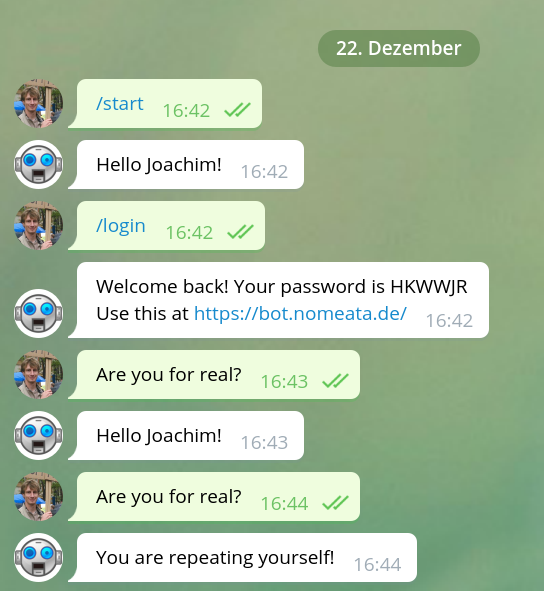

# pybotbrain: Programming a Telegram bot is kinderleicht

This project was created to help with this problem: How can I introduce my
niece and nephew to the wonders of programming? I needed a program environment
that is

 * frictionless, because every bit of annoyance about installing tooling, bad
   editors, annoying red tape (such as having to save and run a command to see
   error messages) take a toll on motivation and attention

 * relevant, so that they can immediatelly build something that is interesting
   and interacts with their world

In this particular case, I decided to make it as easy as possible for them to
program their very own Telegram bot. Using a web-based editor environment,
there is no setup to worry about. Live code checking means that at least
obvious syntax error are caught before they try to press “Deploy”. And already
with very very simple programming skills (`if`, string comparison) the kids can
write, for example, elaborate interactive fiction.

## The service

To that end, I created `pybotbrain`. This is a service running on the internet
that can host any number Telegram bots (i.e. it receives messages to these bots, and responds to them). It allows the “owners” of these bot to program the inner logic of the bot very effortless with the browser, as the following screenshots show:

Interaction with a bot                                        | The web interface
:------------------------------------------------------------:|:--------------------------------------------------------:
   | 

## What is the API for the bot’s code?

 * To react to a private message, define a function `def private_message(sender,
   text)`. If you return a string, it will become the bot’s response.

 * To react to a group message, define a function `def group_message(sender,
   text)`. If you return a string, it will become the bot’s response.

 * You can remember things in the `memory` dictionary.

## Can I use it?

At the moment, the Python code evaluation is not sufficiently sand-boxed. If
and when I fix that, I can maybe allow my instance of `pybotbrain` to be used
by anyone.

Until then, if you dare, you are welcome to run it on your own. You do not need
a server for it, just an Amazon Webservices account, and it will very likely
run well within the free tier. See `./Building.md` for instructions.

## Can I contribute?

Sure! Some things on the TODO list are:

 * Write target-audience compatibe documentation

   Some first steps are in `docs/`

 * Make this safer to run

   In particular, find the minimal necessary AWS policy for the Lambda
   function, and sandbox the Python execution. Also size limits on code and state.

 * Prettier UI

   In particular, make the editor window take the full available vertical
   space. Maybe switching from Bulma to a more modern, flexbox-based CSS
   framework might make that easier.

 * Error handling

   In particular in the UI.

 * Sensible polling for events and memory changes

   Events should probably be their own DynamoDB entries, with a time-to-live.
   The Frontend should use not always donwload the full list of event, but only
   those that are new since the last one.

 * Rewrite the backend in a different language

   If the python sandboxing allows that (maybe because it is
   [RustPython](https://github.com/RustPython/RustPython) running in
   WebAssembly, as done in [this
   project](https://github.com/robot-rumble/logic/)), maybe rewriting the
   backend in a nicer language
   ([Haskell?](https://github.com/robot-rumble/logic/)) is appropriate.

 * Easier sign up

   Probably only relevant once this is safe enough to run publicly, but then it
   would be nice if users could just forward the `@botfather`’s message with
   the bot key to, say, `@pybotbrainbot`, and that’s enough to sign the bot up.

 * Carefully adding capabilities to the bot

   This will never expose the full complexity of the [Telegram Bot
   API](https://core.telegram.org/bots/api). The goal is to teach programming
   and allow the kids to do many fun and interesting and useful things – not
   necessarily _all_ the things.

   That said, a careful extension of the capabilities, especially if they don’t
   make the first steps more complicated, are useful. Especailly important
   features like “sending stickers”.

